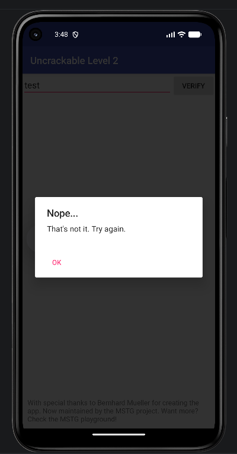
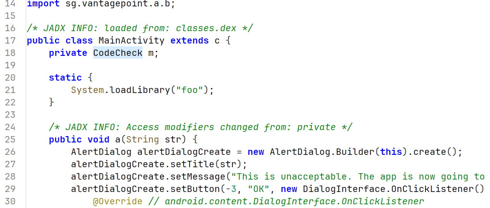
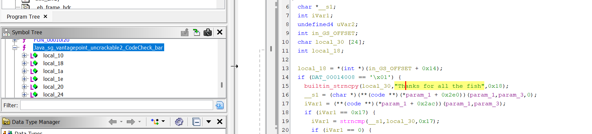
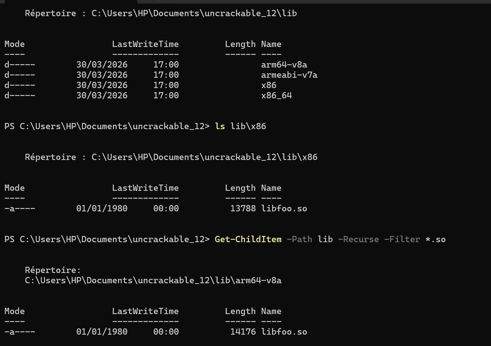
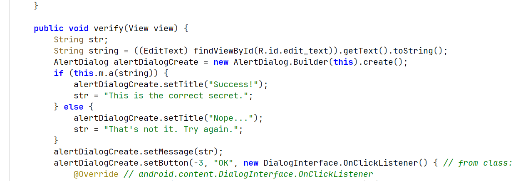
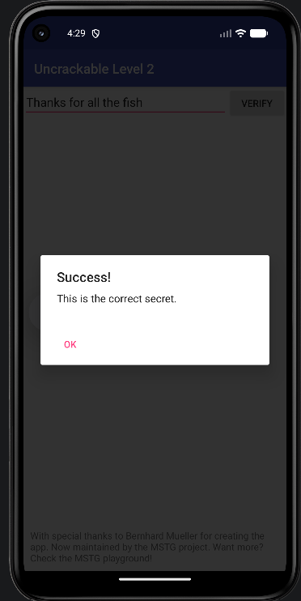

# Uncrackable Level 2 - Reverse Engineering Lab

## Description

Ce laboratoire documente l'analyse complète de l'application Android **Uncrackable Level 2**, un challenge de reverse engineering issu de l'OWASP Mobile Security Testing Guide (MSTG). L'objectif était de retrouver le secret caché dans l'application en analysant son code Java et sa bibliothèque native.

**Secret trouvé :** `Thanks for all the fish`

---

## Outils utilisés

- **JADX** - Décompilation du code Java
- **Ghidra** - Reverse engineering du code natif
- **ADB** - Installation et test de l'application
- **Python** - Décodage du secret

---

## Méthodologie

### Analyse de l'interface

L'application affiche une interface simple avec un champ de texte et un bouton "VERIFY". Toute saisie incorrecte affiche un message d'erreur, confirmant qu'une logique de comparaison existe.

## Captures d'écran

### 1. Interface de l'application (message d'erreur)


### 2. CodeCheck dans JADX


### 3. Méthode native bar() dans JADX


### 4. Fonction native dans Ghidra


### 5. Code de vérification


### 6. Secret trouvé


### Décompilation avec JADX

L'analyse du code Java décompilé révèle que `MainActivity` récupère la saisie utilisateur et l'envoie à la classe `CodeCheck` :

```java
// MainActivity.java
public void verify(View view) {
    String input = this.editText.getText().toString();
    if (this.m.a(input)) {
        Toast.makeText(this, "Success!", 1).show();
    } else {
        Toast.makeText(this, "Something's wrong...", 1).show();
    }
}